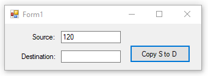

# WinFormSimple
This repository contains the 'SimpleWinForm' project which creates a Windows application with one simple WindowsForm. Demonstrates how to create a WinForm in a VisualStudio project. You can enter text in TextBox 'Source' and after pressing the 'Copy S to D' button the application will save this text in TextBox 'Destination'

## Details
I used VS2017 and Target Framework: .NET Framework 4.5.
 
